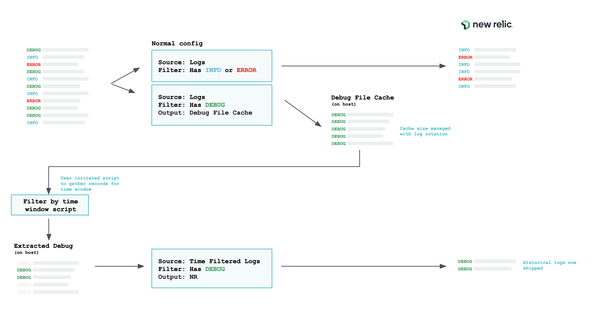

# Logs Rewind/Enrich POC using Fluentbit

This prototype demonstrates how you could mimic a "rewind and enrich" feature.

For this use-case example consider some logs that have log level ERROR, INFO and DEBUG. During normal operation you do not need the DEBUG logs however when an isssue occurs you may want to ingest those logs for analysis. You specify the window of time you want the DEBUG logs from and these get ingested.

In this example we use fluentbit to ship logs to New Relic. The log shipper ships all logs of log level INFO and ERROR but does not ship DEBUG level logs. Instead it pushes the DEBUG logs to a cache file. This cache could be log roated to keep it from growing. 

When you need the DEBUG logs for a time window we call a further fluentbit configuration, which consults the cahce and extracts the logs for the period specified. It then places this in a location the general shipper will ship them. It could ship them directly too of course.



### Prototype Running instructions
On an Amazon linux EC2 do the follwing. The fluentbit config should work anywhere but the scripts might need adjusting for other OS's.

- [Install fluentbit](https://docs.fluentbit.io/manual/installation/linux/amazon-linux):
```
curl https://raw.githubusercontent.com/fluent/fluent-bit/master/install.sh | sh
```
- Install GIT
```
sudo yum update
sudo yum install git
```

- Clone this repo
```
git clone https://github.com/jsbnr/nr-fluentbit-logsrewind-poc logrewind
```

- Generate test data (in one window)
```
~/logrewind/config/generateTestData.sh -P ~/logrewind/logs/generated.log
```

- Start the log shipper (in another window)
You need to provide a source for the logs, a destination for the cache of  logs that are not shipped and a path for the extracted logs. Also add your New Relic logs ingest API key. Leave it running for a bit and confirm logs are coming into New Relic by searching for the tool attribute: `tool:logrewindpoc`
```
~/logrewind/config/startLogShipper.sh -S "$( eval echo ~ )/logrewind/logs/*.log" -C "$( eval echo ~ )/logrewind/cache/debug_cache.log" -E "$( eval echo ~ )/logrewind/extracted/*.log" -K "...your-api-key...NRAL"
```

- Extract data for chosen window (in yet another window)
Here we need to supply the file paths and then a start and end time for the window of data we're interested in:
```
~/logrewind/extractLogs.sh -S "$( eval echo ~ )/logrewind/cache/debug_cache.log" -T "$( eval echo ~ )/logrewind/extracted/extracted_" -s "2023/06/16 13:19" -e "2023/06/16 13:20"
```